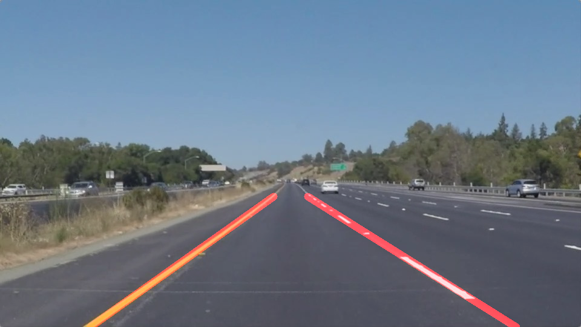

# **Finding Lane Lines on the Road** 

## Overview
---

When we drive, we use our eyes to decide where to go.  The lines on the road that show us where the lanes are act as our constant reference for where to steer the vehicle.  Naturally, one of the first things we would like to do in developing a self-driving car is to automatically detect lane lines using an algorithm.

This project is an initial look at processing images and video feeds from a car camera. Here, images and videos are processed and lines are drawn on the image representing our best guess of the lane lines on the road. The project looks for changes in color to determine where lane lines are.  This works well when the road is one color, the lines are another and there are no other sharp color changes.  As can be seen in the challenge video, shadows and changes in the color of the pavement can wreak havoc on the programs ability to accurately detect lane lines.

## Running the Ipython Notebook
---

### If you have already installed the [CarND Term1 Starter Kit](https://github.com/udacity/CarND-Term1-Starter-Kit/blob/master/README.md) you should be good to go!   If not, you should install the starter kit to run this project. ###

**Step 1:** Set up the [CarND Term1 Starter Kit](https://classroom.udacity.com/nanodegrees/nd013/parts/fbf77062-5703-404e-b60c-95b78b2f3f9e/modules/83ec35ee-1e02-48a5-bdb7-d244bd47c2dc/lessons/8c82408b-a217-4d09-b81d-1bda4c6380ef/concepts/4f1870e0-3849-43e4-b670-12e6f2d4b7a7) if you haven't already.

**Step 2:** Open the code in a Jupyter Notebook